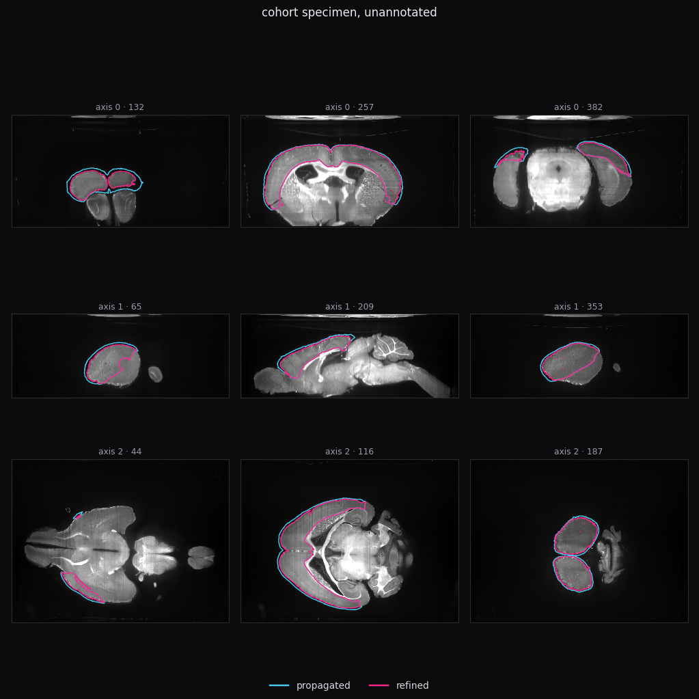
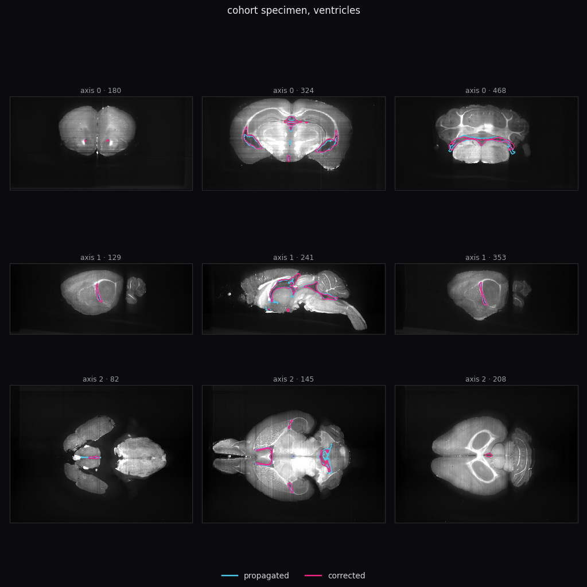

# atlas-refine

Tools for correcting atlas-propagated brain annotations against a small
number of manual ones, and for determining when a correction is valid.
Operated jointly by a human and an agent; neither role is sufficient alone.

## Purpose

The objective is to accelerate generation of ground-truth neuroanatomic
annotations, which serve as reference regions for evaluating and improving
registration to a chosen template.

Reverse registration — warping a template's parcellation onto each specimen
via the inverse of the specimen-to-template transform — produces a complete
annotation for every specimen at no per-specimen annotation cost. Its
boundaries follow template anatomy rather than the anatomy present in each
acquisition, so they carry systematic, structure-specific error: the same
deformation resolves the same structure the same way across specimens.

This is a two-stage, iterative process:

1. **Propagate.** Reverse-register the template parcellation onto a specimen
   through the existing registration pipeline. This is the zero-cost
   baseline annotation.
2. **Correct and reintroduce.** A small number of specimens are manually
   corrected against the propagated label. The disagreement is measured, a
   correction is fitted, and it is validated against annotations excluded
   from the fit. Once ground truth exists for a structure, it can be
   supplied to the registration stage itself as an additional similarity
   term (`registration.MetricTerm`), constraining the deformation with
   anatomy that image intensity alone does not localize. Re-running
   propagation with the constrained registration improves label placement
   at the source, for that structure, across the whole cohort — not only for
   the specimens that were corrected.

Round *n*'s corrected annotations improve round *n*+1's registration. The
package provides the propagation, correction, and validation stages, and
the mechanism (`MetricTerm`) for feeding annotations back into registration;
it does not run this loop automatically — each round is scoped by an
operator (see *Operating model*).

The correction method itself cannot be fixed in advance. The two dominant
failure modes require near-opposite operations: over-coverage of a
lower-intensity margin is removed by an intensity threshold; under-coverage
of an interior with contrast on both boundaries requires expansion followed
by a contour or deformable method. Which mode applies to a given structure
is not predictable from the structure's identity — it is a property of how
that registration resolved that structure in that cohort, observable only
after propagation, and it can differ between two boundaries of the same
structure. (Measured directly in this repository: isocortex's
background-facing and white-matter-facing boundaries required opposite
treatments in the same specimens.) Sample size compounds this — one to five
corrected specimens per structure, an order of magnitude below what
supervised segmentation requires — so the problem is posed as constrained
program synthesis over a small operator space (thresholds, morphological
operations, deformable/contour methods), conditioned on a measured error
signature, and checked against an exact, inexpensive criterion: agreement
with held-out ground truth.

## Operating model

The package supplies measurement and validation; it does not supply
judgment. Two roles are required, and the tool is not intended to be run by
either alone.

| | provides | cannot be delegated because |
|---|---|---|
| **Human** | manual annotation; approval to apply a correction to the cohort or to reintroduce it into registration | ground truth requires expert judgment; approval requires accountability |
| **Agent** | interpretation of measurements — which correction family the failure mode and anatomy support, whether a fit generalizes, whether a rendered label is plausible | the mapping from failure signature to correction is not enumerable in advance (see *Purpose*) |

No command executes propagate → correct → validate → reintroduce end to
end. `atlas-refine` exposes three commands (below); the remaining stages
are driven through the Python API in a session where both roles are
present.

### Result, one structure

Isocortex: Dice 0.905 (propagated) → 0.976, one free parameter fitted on
two independent annotations, transferring to a held-out specimen at 0.968.
A second parameter (region-wise thresholding, background-facing vs.
white-matter-facing) changed the fitted score by 0.0005 against its full
search range and was discarded. Screening applied to all ten specimens
(two annotated, eight not) identified a 24% left–right volume asymmetry on
an unannotated specimen, subsequently attributed to registration rather
than to the correction — a failure mode no annotation-based metric could
have surfaced, since none existed for that specimen.

<p align="center">
  
</p>

<sub>`render_panel` output for the specimen above: propagated (cyan) and
corrected (magenta) isocortex outlines over intensity, sliced through the
label's extent. `axis 2 · 44` shows the asymmetry directly — a large
labelled region on one side, a small fragment on the other. Specimen
identity and array-axis-to-anatomy mapping are not established here; see
`skills/visual-review/SKILL.md`.</sub>

## Install

```bash
pip install -e ".[dev]"
```

Python 3.10+. Registration requires ANTsPy. Characterization, analysis, and
review require NumPy, SciPy, and Matplotlib only.

## Usage

### Human: annotation and approval

```bash
atlas-refine ingest --store ground_truth --inbox inbox \
    --reference "data/<sid>/image.nii.gz" --frame "spec-{sid}" \
    --spacing 80 80 80 --unit um
atlas-refine status       # holdings by structure, split by admissibility
atlas-refine algorithms   # registered correction families and parameters
```

Filename: `<specimen>__<structure>__<basis>__<annotator>__<YYYY-MM-DD>.seg.nrrd`.
`basis` — `pushed` (from the propagated label), `scratch`, or `refined` (from
a correction's output) — is not verifiable at intake and determines
admissibility: `pushed`/`scratch` are independent evidence; `refined` is not,
since its optimum is pinned to the parameter that produced it.

### Agent: propagation, characterization, fitting, review

```python
from atlas_refine.algorithms import REGISTRY
from atlas_refine.analysis import next_to_annotate, profile_image, screening_brief
from atlas_refine.characterize import characterize
from atlas_refine.evaluate import check_admissible, fit, measure_transfer
from atlas_refine.io import GroundTruthStore
from atlas_refine.registration import MetricTerm, propagate_labels, register
from atlas_refine.review import rank_cohort, render_panel, screen_label

store = GroundTruthStore("ground_truth")
independent = store.fitting_set("isocortex")

print(screening_brief("isocortex"))                    # anatomically admissible families
profiles = {sid: profile_image(image) for sid, image in cohort_images.items()}
print(next_to_annotate(profiles, independent).describe())

signature = characterize(image, propagated, reference)  # how the label disagrees
algorithm = REGISTRY.create("contrast_threshold")
check_admissible(algorithm, independent)                 # parameter budget
result = fit(algorithm, independent, loader)
transfer = measure_transfer(algorithm, result.params, independent[:1], independent[1:], loader)

# reintroduce ground truth as a registration constraint (round n+1)
registration = register(moving=template, fixed=specimen_image,
                        extra_metrics=[MetricTerm(fixed=specimen_gt, moving=template_gt)])
propagated_next_round = propagate_labels(template_labels, specimen_image, registration)

# screen every specimen the fit was applied to, scored or not
screens = [screen_label(labels[sid], images[sid], specimen=sid) for sid in cohort]
for review in rank_cohort(screens):
    print(review.describe())
render_panel(images[sid], {"propagated": pushed, "refined": corrected}, f"review/{sid}.png")
```

`loader` maps a specimen id to `(image, propagated_label, reference)`. Full
walkthrough: [docs/workflow.md](docs/workflow.md).

## Review

Correction is validated by exact agreement wherever ground truth exists;
`atlas_refine.review` covers the specimens where it does not — typically the
majority, since a correction fitted on few specimens is applied to the full
cohort.

- `screen_label` — reference-free plausibility: fragmentation, hemispheric
  asymmetry, interior punctures vs. anatomy a structure legitimately
  encloses, boundary sharpness. `rank_cohort` orders a cohort by priority
  for review.
- `render_panel` — label outlines over specimen intensity, sliced through
  the label's extent, for a human or vision-capable agent.

Neither establishes correctness — only implausibility, or its absence. See
`skills/visual-review/SKILL.md`.

<p align="center">
  
</p>

<sub>The same rendering applied to ventricles: propagated (cyan) versus a
manually corrected annotation (magenta). `axis 0 · 324` shows both lateral
ventricles, where the correction moves the boundary onto the fluid-filled
lumen the propagated label under- or over-reached.</sub>

## Package contents

```
src/atlas_refine/
    io/              volume container (explicit unit/frame); annotation store
    registration/    two-stage registration; MetricTerm-constrained refinement;
                     single-resampling label propagation
    characterize/    quantifies propagated-vs-reference disagreement
    algorithms/      correction families, registry, contribution gate
    analysis/        annotation-free acquisition, cohort, boundary, and
                     anatomical-context measures
    evaluate/        fitting, transfer scoring, admissibility, leave-one-out
    experiments/     append-only log of correction attempts
    review/          plausibility screening and rendering, annotation-free
    cli.py           ingest / status / algorithms
```

Six correction families: `contrast_threshold`, `band_threshold`,
`hysteresis_threshold`, `morphological_cleanup`,
`regional_threshold` (shell vs. interior, by neighbor polarity), and
`caliber_threshold` (thin vs. thick, by local width). New families
subclass `RefinementAlgorithm`; `algorithms/contribute.py` gates admission
on correctness and a substantive rationale, not on score. See
[docs/authoring.md](docs/authoring.md).

## Skills

Five `SKILL.md` packages (Agent Skills open standard) encode the
interpretation applied to these measurements:

| skill | scope |
|---|---|
| `image-analysis` | Annotation-free acquisition profiling; next-specimen selection |
| `neuroanatomy` | Structure adjacency and polarity; admissible-family screening |
| `segmentation-correction` | Signature-to-family routing; fitting and transfer |
| `visual-review` | Rendered-label interpretation; unscored-specimen triage |
| `evidence-analysis` | Validity of a reported result at a given sample size |

## Guarantees enforced in code

- **Provenance.** `GroundTruthStore` excludes `refined`-basis annotations
  from fitting and validation automatically.
- **Parameter budget.** Fitting is refused when free parameters exceed
  independent annotations.
- **Geometry.** Volumes carry explicit unit and coordinate frame; operations
  between them assert compatibility.
- **Contribution rationale.** A contributed algorithm is rejected if its
  rationale matches the scaffold placeholder, by content comparison.

These constrain what an incorrect judgment can produce; they do not
substitute for the judgment of the human and agent operating the tool.

## Testing

```bash
PYTHONPATH=src python3 -m pytest tests -q
```

224 tests. Registration is validated against synthetic phantoms with known
displacement, including run-to-run reproducibility, which requires a
non-zero random seed and single-threaded execution — ANTs treats a seed of
zero as an instruction to seed from the system clock.

## License

MIT
